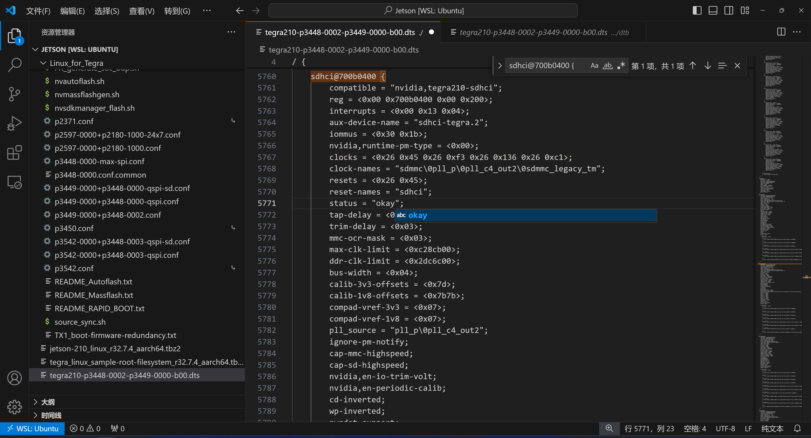
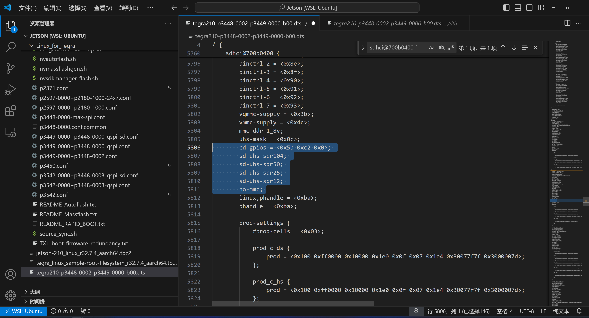
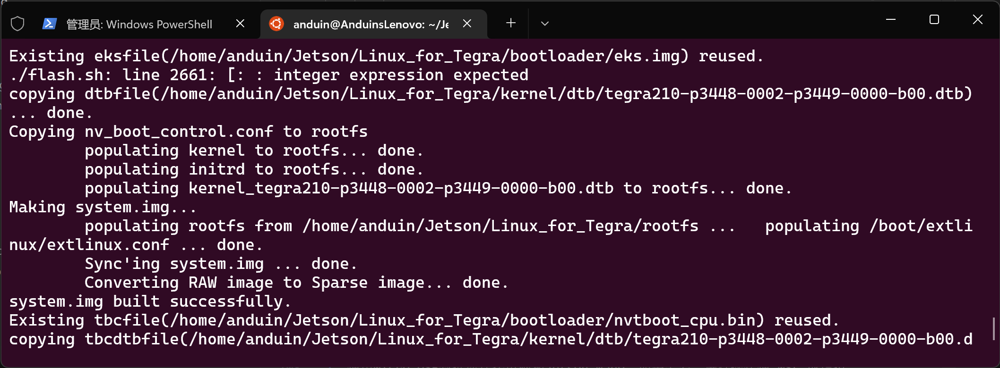
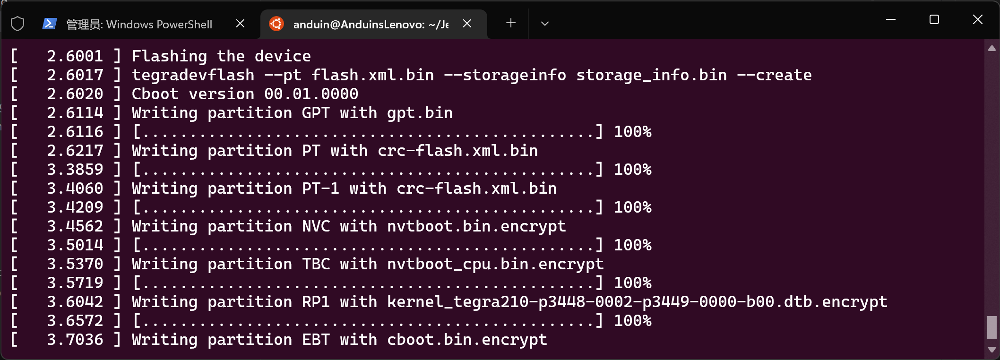
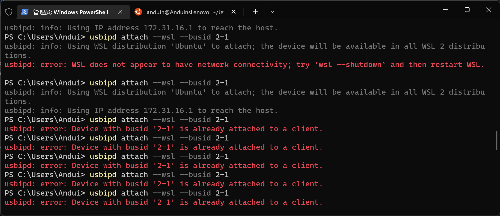
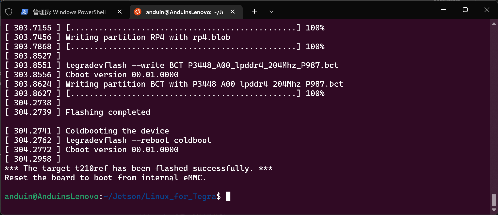

# Jetson Nano (Waveshare)

> 官方文档：https://www.waveshare.net/wiki/JETSON-NANO-DEV-KIT

官方支持的最高系统版本是 Ubuntu 18.04，自带Python 3.6.9。

## 0. 准备

### 硬件
1. Jetson Nano 开发板
2. 5V 4A 电源适配器
3. 跳线帽（双母头杜邦线也可）
4. Micro-USB数据线
5. 显示器（可使用HDMI或DP）
6. SD卡

### 软件
Debian系的Linux发行版，虚拟机或实体机均可。教程使用WSL。
> Ubuntu 22.04 实体机、VMware Workstation on Windows、VMware Fusion on Mac(x86) 也已通过测试。所有Arm架构的设备（树莓派，MacBook on Apple Silicon）都没有通过测试。

## 1. 下载资源
1. 进入你的Linux系统，创建一个新的目录来存放相关文件。
    ```shell
    mkdir Jetson
    cd Jetson
    ```
    如果没有，安装`wget`
    ```shell
    sudo apt-get install wget
    ```

2. 下载资源
    ```shell
    wget https://developer.nvidia.com/embedded/l4t/r32_release_v7.4/t210/jetson-210_linux_r32.7.4_aarch64.tbz2
    wget https://developer.nvidia.com/embedded/l4t/r32_release_v7.4/t210/tegra_linux_sample-root-filesystem_r32.7.4_aarch64.tbz2
    ```

3. 解压
    ```shell
    sudo tar -xjf jetson-210_linux_r32.7.4_aarch64.tbz2
    cd Linux_for_Tegra/rootfs/
    sudo tar -xjf ../../tegra_linux_sample-root-filesystem_r32.7.4_aarch64.tbz2
    cd ..
    sudo ./apply_binaries.sh
    ```
    > 第二、三行的目的是将`root-filesystem`解压到`Linux_for_Tegra/rootfs/`目录下。

## 2. 修改设备树

> 让系统可以识别到SD卡。

1. 安装修改工具
    ```shell
    sudo apt-get install device-tree-compiler
    sudo apt-get install qemu-user-static
    sudo apt-get install libxml2-utils
    ```

2. 反编译二进制文件
    > 确保你在`Linux_for_Tegra`目录下。
    ```Shell
    cd kernel/dtb
    sudo dtc -I dtb -O dts -o tegra210-p3448-0002-p3449-0000-b00.dts tegra210-p3448-0002-p3449-0000-b00.dtb 
    ```

3. 修改设备树

    要修改的文件：`tegra210-p3448-0002-p3449-0000-b00.dts`
    > 由于文件很长，使用终端编辑的话很费劲，所以建议用 Visual Studio Code 连接 WSL 后查看这个文件，复制全文并修改。然后使用`sudo`权限覆盖掉原文件。
    
    > 如果你是带GUI的虚拟机或实体机的话，可以使用`sudo gedit`进行修改。

    + 在目录`Linux_for_Tegra`以外新建一个新文本文件，名为`tegra210-p3448-0002-p3449-0000-b00.dts`。

    + 将`Linux_for_Tegra/kernel/dtb/tegra210-p3448-0002-p3449-0000-b00.dts`的文件内容复制到新建的文件中，并进行修改。

    + 查找`sdhci@700b0400 {`，修改其下方的值：
    
        - `status`的值改为`okay`
        - `uhs-mask`的值改为`<0xc>`
        - 添加这些值：
            ```
            cd-gpios = <0x5b 0xc2 0x0>; 
            sd-uhs-sdr104; 
            sd-uhs-sdr50; 
            sd-uhs-sdr25; 
            sd-uhs-sdr12; 
            
            no-mmc; 
            ```
        

    + 保存后执行命令覆盖文件
        ```shell
        sudo cp tegra210-p3448-0002-p3449-0000-b00.dts Linux_for_Tegra/kernel/dtb
        ```

4. 重新编译回二进制文件
    ```
    sudo dtc -I dts -O dtb -o tegra210-p3448-0002-p3449-0000-b00.dtb tegra210-p3448-0002-p3449-0000-b00.dts
    ```
    会报一堆Warning，别慌，这是正常的。


## 3. 烧写系统

1. 用跳线帽或杜邦线连接`FC REC` 和 `GND`引脚。

2. 使用Micro-USB数据线连接电脑和Jetson Nano。如果需要，进行操作使 WSL 或虚拟机能够识别 Jetson Nano。

3. 确保你在`Linux_for_Tegra`目录下，执行以下命令：
    ```shell
    sudo ./flash.sh jetson-nano-emmc mmcblk0p1
    ```
    + 这边建议开两个终端窗口，一个 Ubuntu 看进度，一个 PowerShell 重新挂载 USB 设备，因为这个操作会断开设备重新连接，但是 WSL 没法自动连接。所以在下图这块`Making system.img`的部分（这里要花一些时间）开始在 PowerShell 重复输入挂载设备，就是重复输入`usbipd attach --wsl --busid <busip>`别停。
    

    + 直到看见 Ubuntu 里开始传文件了，或者 PowerShell 里怎么打都是显示`Device with busid '<busid>' is already attached to a client.`就可以停下了。
    
    

    + 当然，你如果没用 WSL，当我没说，继续。

4. 等吧，时间挺长的。最后显示这个就说明成功了。
    

## 4. 配置系统

1. 移除跳线帽，拔掉数据线。接上电源、键鼠和显示器。
2. 这里有友好的 GUI，按照步骤初始化系统。（语言一定选英文！Ubuntu的中文终端有一堆Bug会直接导致用不了远程开发）

## 5. 配置SD卡

> 这些操作是在 Jetson Nano 上的系统进行。
1. 插上 SD 卡（建议 64GB 及以上，因为 CUDA 很大），开机。
2. 查看设备
    ```shell
    sudo ls /dev/mmcblk*
    ```
    如果出现了`/dev/mmcblk1`，那么说明我们第2步完全没问题，可以做接下来的操作了。

3. 取消挂载
    ```shell
    sudo umount /media/(使用tab补齐)
    ```
    如果狂按tab还是没反应，说明压根没挂载，跳过这一步。

4. 格式化 SD 卡
    ```shell
    sudo mkfs.ext4 /dev/mmcblk1
    ```

    按Y后Enter确定

5. 再次查看设备
    ```shell
    sudo ls /dev/mmcblk*
    ```
    现在这里应该只有`/dev/mmcblk1`了。

6. 修改启动路径
    ```shell
    sudo nano /boot/extlinux/extlinux.conf
    ```

    找到下面这部分：
    ```
    APPEND ${cbootargs} quiet root=/dev/mmcblk0p1 rw rootwait rootfstype=ext4 console=ttyS0,115200n8 console=tty0 
    ```

    将`mmcblk0p1`改为`mmcblk1`。

7. 挂载 SD 卡
    ```shell
    sudo mount /dev/mmcblk1 /mnt
    ```

8. 复制系统
    ```shell
    sudo cp -ax / /mnt 
    ```

    这段没有任何输出，时间还挺长，再等吧。

9. 取消挂载（别拔出来！）
    ```shell
    sudo umount /mnt/ 
    ```

10. 重启
    ```shell
    reboot
    ```

重启过后如果能正常进系统，那就成功了。

## 6. 配置环境

1. 换源。内容参考[清华源](https://mirrors.tuna.tsinghua.edu.cn/help/ubuntu-ports/)，记得把版本换成18.04(bionic)。

2. 更新软件列表
    ```
    sudo apt-get update
    ```

3. 安装 CUDA
    ```
    sudo apt-get install nvidia-jetpack
    ```

    等吧，要下6个G的东西。

4. 别装Pyhton版本的yolo，因为`python-opencv`会触发GTK版本冲突，导致只能推断图片和视频文件，而不能推断摄像头的视频流。可以试试C/C++的框架darknet，亲测成功。
    ```
    https://github.com/AlexeyAB/darknet
    ```
