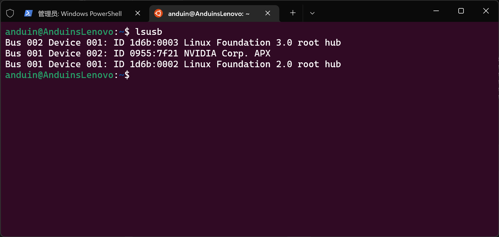
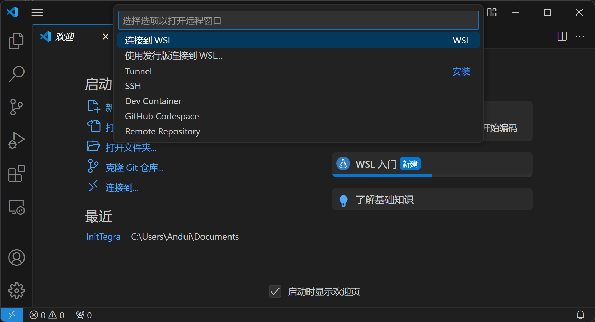

# 安装WSL 2

## 条件

+ Windows 10 2004 及更高版本或 Windows 11
+ x86_64 架构处理器

## 安装

> 参考链接: https://learn.microsoft.com/zh-cn/windows/wsl/install

> 建议先从 Microsoft Store 中安装“终端”应用（Windows 11 自带），这个应用允许多个标签页，便于管理。

1. 以管理员权限打开 Windows PowerShell：
    + Windows 10: `Win` + `X`，点击“Windows PowerShell(管理员)(A)”
    + Windows 11: `Win` + `X`，点击“终端管理员(A)”

2. 运行以下命令：
    ```PowerShell
    wsl --install
    ```
    这样默认安装Ubuntu 22.04（这条教程出自2024/06/05，实际运行可能会有变化），如果你想安装其他发行版，使用`-d`选项指定发行版：
    ```PowerShell
    wsl --install -d ubuntu-22.04
    ```
    
    
    安装好后开始菜单会增加两项：`Ubuntu` 和 `WSL`。

3. 配置
    打开开始菜单中的 Ubuntu，上面会显示新的命名与设置密码，进行设置。配置好后就可以使用了。
    

    现在你也可以在 Windows 文件管理器下查看 Linux 系统中的文件，但是只有修改你用户主文件夹中内容的权限。
    

    “终端”应用也添加了Ubuntu的选项，可以在这里访问 WSL 的终端。
    


## 换源
与普通的 Ubuntu 相同，都是修改`/etc/apt/sources.list`文件。
```shell
sudo nano /etc/apt/sources.list
```
具体内容参考[清华大学开源软件站的指导](https://mirrors.tuna.tsinghua.edu.cn/help/ubuntu/)，记得选择对应的系统版本。

编辑完成后，运行以下命令以更新软件列表。
```
sudo apt-get update
```

## 设置访问USB设备

> 参考链接: https://learn.microsoft.com/zh-cn/windows/wsl/connect-usb

1. 从 GitHub 上下载 USB/IP 开源项目`usbipd-win`
    ```
    https://github.com/dorssel/usbipd-win/releases/tag/v4.2.0
    ```

    选择下载`usbipd-win_4.2.0.msi`，并在 Windows 环境下运行、安装。

2. 检查 USB 设备
    在 PowerShell(管理员) 中运行以下命令，这将列出所有连接到 Windows 的 USB 设备。
    ```PowerShell
    usbipd list
    ```

    
    这里我插入了 Jetson Nano。

3. 记住想连接设备的`BUSID`，然后运行以下命令。运行命令后，请再次使用命令`usbipd list`验证设备是否已共享。
    ```PowerShell
    usbipd bind --busid <busid>
    ```

    

4. 保证 Ubuntu 虚拟机正在运行，执行以下命令：
    ```PowerShell
    usbipd attach --wsl --busid <busid>
    ```
    注意，只要 USB 设备连接到 WSL，Windows 将无法使用它。

    你可以在 Ubuntu 的终端下运行`lsusb`命令查看设备。
    


## Visual Studio Code 连接 WSL

1. 安装插件
    在扩展选项卡中查找 “WSL”，找到作者为 Microsoft 的扩展并安装。
    

2. 连接
    点击左下角的“打开远程窗口”按钮，在出现的菜单中选择“连接到 WSL”
    
    等待右下角的进度条跑完。

3. 打开项目
    和在本机打开文件夹相同，只是没有 GUI。
    

> 本机和 WSL 安装的插件不共享，你需要另外安装一些语言的支持插件。

## 配置 CUDA （不是N卡游戏本别碰快跑）

> 参考链接：https://learn.microsoft.com/zh-cn/windows/ai/directml/gpu-cuda-in-wsl

**没有 RTX 显卡的电脑千万别折腾这玩意！**

**没有 RTX 显卡的电脑千万别折腾这玩意！**

**没有 RTX 显卡的电脑千万别折腾这玩意！**

在 Jetson Nano、WSL 和远程服务器上配置`darknet`框架下的`Yolov4`方法大致相同，因此介绍在 WSL 上配置 CUDA 用于赛博炼丹的方法。你也可以在`darknet`项目的`README`查看在 Windows 上构建原生`darknet`框架的方法。
> 另一个原因是老师给的服务器不给`sudo`权限，导致C和C++版本的`darknet`没法编译，所以要用自己的电脑炼丹。

0. 电脑上要存在 RTX 显卡的驱动（这个应该有吧，不然打不了游戏）。

1. 移除 GPG Key
    ```shell
    sudo apt-key del 7fa2af80
    ```

2. 添加源
    ```shell
    wget https://developer.download.nvidia.com/compute/cuda/repos/wsl-ubuntu/x86_64/cuda-wsl-ubuntu.pin
    sudo mv cuda-wsl-ubuntu.pin /etc/apt/preferences.d/cuda-repository-pin-600
    wget https://developer.download.nvidia.com/compute/cuda/12.5.0/local_installers/cuda-repo-wsl-ubuntu-12-5-local_12.5.0-1_amd64.deb
    sudo dpkg -i cuda-repo-wsl-ubuntu-12-5-local_12.5.0-1_amd64.deb
    sudo cp /var/cuda-repo-wsl-ubuntu-12-5-local/cuda-*-keyring.gpg /usr/share/keyrings/
    ```

3. 安装 ToolKit
    ```shell
    sudo apt-get update
    sudo apt-get -y install cuda-toolkit-12-5
    ```

4. 添加环境变量
    
    现在你的 Linux 系统`/usr/local/`目录下应该存在`cuda`相关的文件夹了。
    
    
    将其添加到环境变量中。
    ```shell
    nano ~/.bashrc
    ```

    将以下三行添加到文件的末尾：（由于不知道此处cuda的版本号，因此下方应该替换成对应版本。示例为12.5）
    ```shell
    export CUDA_HOME="/usr/local/cuda-12.5:$CUDA_HOME"
    export PATH="/usr/local/cuda-12.5/bin:$PATH"
    export CUDA_LIB="/usr/local/cuda-12.5/lib64:$CUDA_LIB"
    ```

    保存文件，执行命令`source ~/.bashrc`以应用修改。

5. 测试

    运行
    ```shell
    nvcc -V
    ```

    如果输出了 CUDA 的版本，则安装成功。
    
